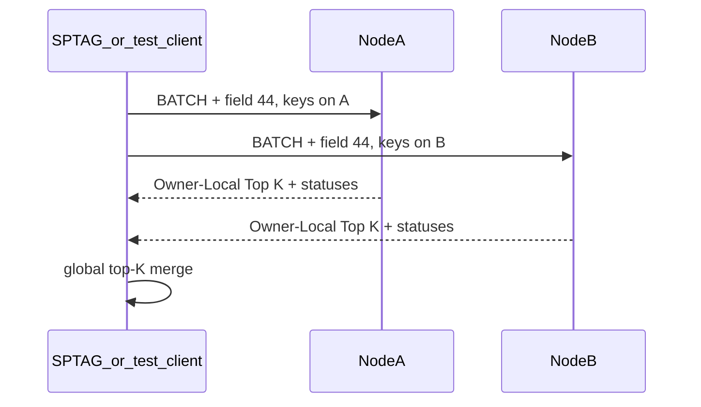

# Phase 3 — Native tail distance on posting bins

**Repo:** Aerospike server CE fork  
**Depends on:** Phase 1 contract doc (`docs/contracts/sptag-aerospike.md`); posting byte layout defined in contract  
**Blocks:** Phase 4 SPTAG wiring  
**Wire decision:** [ADR 0004](../adr/0004-vector-distance-protocol.md) — batch message field 44/45, not `AS_MSG_OP_*`

---

## Project context (read first)

**SPTAG** (separate codebase) at query time:

1. Loads head graph into RAM (`graph.bin`, RNG, BKT/KDT)
2. Searches `m_pGraph` locally → head IDs
3. Fetches **posting-list blobs** from Aerospike (key = head ID) — today often MultiGet; Phase 4 may use `VECTOR_DISTANCE` instead of client-side distance
4. Today: runs `ComputeDistance` on tail vectors inside posting bytes
5. Merges top-K

**Your job:** implement step 4 on the **Aerospike server** in native C/C++ — **not** Lua UDF, **not** graph search.

`AS_PARTICLE_TYPE_VECTOR` in `as/include/base/datamodel.h` still uses the **blob vtable** in `as/src/base/particle.c`. EC528 tail distance is implemented in `as/src/vector/` via the batch handler; it reads posting bytes from `BLOB` or `VECTOR` bins.

---

## Problem

- Client-side `ComputeDistance` does not scale QPS / adds SPTAG CPU load
- Lua UDF path was tried — too slow for p99 targets
- Need partition-local distance so each node computes only for records it owns

---

## Spec-driven + test-driven (this phase)

1. Read `docs/specs/phase-3-vector-distance.md` + `docs/contracts/sptag-aerospike.md` + ADR 0004
2. **Red (order matters):**
   - `as/src/vector/vector_math_test.cc` — `SPEC-3-VDIST-*` (known L2/cosine pairs)
   - `as/src/vector/vector_posting_test.cc` — `SPEC-3-PARSER-*` (hex fixture from contract)
   - `as/src/vector/vector_wire_test.cc` + `tests/conformance/vector_distance/` — `SPEC-3-OP-*`
   - `as/src/vector/vector_cfg_test.cc` — `SPEC-3-CFG-*` for namespace parsing
3. **Green:** implement distance, parser, wire codec, batch handler, cfg
4. Wire gtest into `as/src/Makefile` (`make -C as run-vector-tests`; gtest from `bin/install-dependencies.sh`)
5. Mark specs `verified`

**Forbidden:** ship handler without wire conformance tests passing.

---

## Your mission

1. Add namespace config: `vector-dimension`, `vector-value-type`, `vector-metric` (+ optional limits)
2. Add `as/src/vector/` + `as/include/vector/` modules: posting parser, SPTAG-compatible distance, wire codec, Owner-Local Top-K
3. Add proto **field types** `AS_MSG_FIELD_TYPE_VECTOR_DISTANCE` (44) and `AS_MSG_FIELD_TYPE_VECTOR_DISTANCE_RESPONSE` (45) in `as/include/base/proto.h`
4. Hook **`as/src/base/batch.c`**: when `AS_MSG_INFO1_BATCH` and field 44 present → `as_vector_batch_handle()` — **not** `process_bin_read_op()`
5. Keep contract doc (`docs/contracts/sptag-aerospike.md`) byte-exact with implementation

---

## Out of scope (do not implement)

- ANN graph storage or traversal on server
- Secondary index on blob hash for similarity
- HNSW / IVF
- Changing SPTAG source (Phase 4 repo)
- `AS_MSG_OP_VECTOR_DISTANCE` on the normal read/bin-op path (rejected in ADR 0004: single-record scoped)
- Server forwarding for `wrong-owner` keys

---

## Design

### Namespace config

In `as/src/base/cfg.c` namespace stanza:

```text
vector-dimension 768
vector-value-type float    # float | uint8 | int8 | int16
vector-metric l2             # l2 | cosine | inner-product
```

Optional limits: `vector-max-head-ids`, `vector-max-topk`, `vector-max-query-bytes`, `vector-max-response-bytes`.

Store on `as_namespace` in `as/include/base/datamodel.h` (see `vector_namespace_cfg.h` / `datamodel.h` for fields).

Reject distance when query length ≠ `dimension * value_type_size` or posting blob is malformed.

### Posting parser

Parser input = raw posting blob bytes (layout in contract doc): repeated `[vid:int32_le][version:uint8][payload]` with no count prefix.

Implementation: `as/src/vector/vector_posting.c`.

### Distance return shape (resolved)

**Owner-Local Top K** across all successfully scored tails in one request: tuples `(head_id_key, vid, version, distance)` plus per-key statuses. Dedupe by `vid` within the request (best distance wins). Documented in contract + ADR 0004.

### Wire path (not bin ops)

| Item | Value |
|------|--------|
| Message flag | `AS_MSG_INFO1_BATCH` |
| Request field | `AS_MSG_FIELD_TYPE_VECTOR_DISTANCE` (44) |
| Response field | `AS_MSG_FIELD_TYPE_VECTOR_DISTANCE_RESPONSE` (45) |
| Namespace | Standard `AS_MSG_FIELD_TYPE_NAMESPACE` field |
| Batch index field 41 | **Not used** for this op |

Request/response binary layout: `docs/contracts/sptag-aerospike.md` v1.

**Handler:** `as_vector_batch_handle()` in `as/src/vector/vector_batch.c`, called from `as/src/base/batch.c` after socket auth.

Per listed `head_id_key`: compute digest → check partition owner → `as_record_get` → load bin → parse → `as_vector_distance_compute` → accumulate top-K → encode response.

### Distance implementation

`as/src/vector/vector_distance.cc` + MIT-adapted `as/include/vector/sptag_distance.h` — mirrors SPTAG `ComputeDistance` (smaller-is-better; cosine/inner-product may be negative).

**SIMD:** scalar path shipped first; AVX2/NEON in separate TUs with CPUID dispatch is a follow-up per ADR 0004 (do not block Phase 4 client wiring on SIMD).

Precedent: `as/src/geospatial/` (C++ module linked into server, `extern "C"` entry points).

### Build

Wire vector sources in `as/src/Makefile` (server objects + `run-vector-tests` gtest target).

---

## Key files (as implemented)

| Action | Path |
|--------|------|
| Create | `as/src/vector/vector_batch.c`, `vector_posting.c`, `vector_wire.c`, `vector_topk.c`, `vector_digest.c`, `vector_types.c`, `vector_distance.cc`, `vector_namespace_server.c` |
| Create | `as/include/vector/*.h` (wire, posting, distance, digest, types, batch) |
| Modify | `as/include/base/proto.h` (field types 44/45) |
| Modify | `as/include/base/datamodel.h` |
| Modify | `as/src/base/cfg.c` |
| Modify | `as/src/base/batch.c` (dispatch to vector handler) |
| Modify | `as/src/Makefile` |
| Update | `docs/contracts/sptag-aerospike.md` |
| Update | `docs/architecture/module-map.md` (batch hook, not `rw_utils`) |

---

## Partition locality



Server **must not** forward to other nodes — client fans out (smart client / parallel requests).

---

## Tests (required)

| Test file | Spec IDs | Notes |
|-----------|----------|--------|
| `vector_math_test.cc` | `SPEC-3-VDIST-*` | distance metrics |
| `vector_posting_test.cc` | `SPEC-3-PARSER-*` | posting layout |
| `vector_wire_test.cc` | `SPEC-3-OP-*` (wire) | encode/decode |
| `vector_topk_test.cc` | top-K / dedupe | |
| `vector_cfg_test.cc` | `SPEC-3-CFG-*` | config validation |
| `tests/conformance/vector_distance/` | `SPEC-3-OP-*` | Python codec locks wire bytes |

Run: `make -C as run-vector-tests` (24 gtests). Live single-node server smoke (`tests/conformance/vector_distance/smoke.py`) deferred to Phase 4.

---

## Acceptance criteria

- [x] Namespace config parses; invalid dim/metric/value-type rejected
- [x] `VECTOR_DISTANCE` (field 44) handler + wire codec; live asd smoke deferred to Phase 4
- [x] No Lua on code path
- [x] Contract doc matches field IDs 44/45 and payload layout
- [x] `// EC528:` on all deltas
- [ ] Full Linux server `make` (CI); vector gtests pass locally (`make -C as run-vector-tests`)
- [x] ADR 0002 and 0004 accepted; module map shows `batch.c` hook

---

## Anti-patterns

- Implementing graph search “while we’re here”
- Using blob sindex wyhash for ANN
- Hooking distance in `process_bin_read_op()` / `read.c` (wrong entry point)
- Adding `AS_MSG_OP_VECTOR_DISTANCE` without ADR change
- Server forwarding for `wrong-owner` keys
- Parsing postings without contract doc alignment

---

## Client note

SPTAG uses a **forked Aerospike C client** (other repo) to send:

- `AS_MSG_INFO1_BATCH`
- namespace field + message field **44** (payload v1 per contract)
- Expect field **45** in the response

This phase implements **server side** only. Phase 4 wires the client.

---

## After you finish

Hand off to Phase 4: server op stable, contract doc has byte-exact posting layout and response format, client sends field 44/45.
