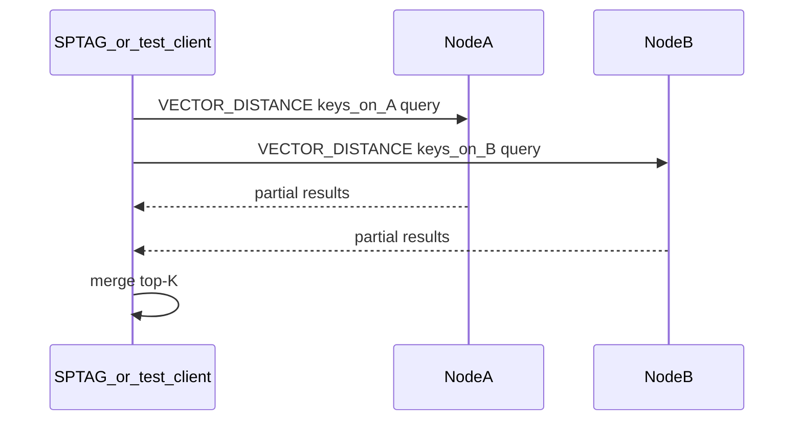

# Phase 3 — Native tail distance on posting bins

**Repo:** Aerospike server CE fork  
**Depends on:** Phase 1 contract doc (`docs/contracts/sptag-aerospike.md`); posting byte layout must be defined (or stubbed with explicit TODO and conservative parser)  
**Blocks:** Phase 4 SPTAG wiring

---

## Project context (read first)

**SPTAG** (separate codebase) at query time:

1. Loads head graph into RAM (`graph.bin`, RNG, BKT/KDT)
2. Searches `m_pGraph` locally → head IDs
3. MultiGets **posting-list blobs** from Aerospike (key = head ID)
4. Today: runs `ComputeDistance` on tail vectors inside posting bytes
5. Merges top-K

**Your job:** implement step 4 on the **Aerospike server** in native C++ — **not** Lua UDF, **not** graph search.

Aerospike CE has **no** vector distance today. `AS_PARTICLE_TYPE_VECTOR` in `as/include/base/datamodel.h` uses the **blob vtable** in `as/src/base/particle.c`.

---

## Problem

- Client-side `ComputeDistance` does not scale QPS / adds SPTAG CPU load
- Lua UDF path was tried — too slow for p99 targets
- Need partition-local SIMD distance so each node computes only for records it owns

---

## Spec-driven + test-driven (this phase)

1. Read `docs/specs/phase-3-vector-distance.md` + `docs/contracts/sptag-aerospike.md`
2. **Red (order matters):**
   - `as/src/vector/vector_math_test.cc` — `SPEC-3-VDIST-*` (known L2/cosine pairs)
   - `as/src/vector/vector_posting_test.cc` — `SPEC-3-PARSER-*` (hex fixture from contract)
   - `as/src/vector/vector_ops_test.cc` or conformance — `SPEC-3-OP-*`
   - cfg tests — `SPEC-3-CFG-*` for namespace parsing
3. **Green:** implement `vector_math`, parser, ops, cfg
4. Wire gtest into cmake (follow `libgtest` in `bin/install-dependencies.sh`)
5. Mark specs `verified`

**Forbidden:** ship op without conformance test passing on single node.

---

## Your mission

1. Add namespace config: `vector-dimension`, `vector-metric`
2. Add `as/src/vector/` module: math + posting parser + wire op handlers
3. Add new proto ops: `AS_MSG_OP_VECTOR_DISTANCE` (+ optional `AS_MSG_OP_VECTOR_BATCH_GET`)
4. Update contract doc with opcode IDs and request/response layout

---

## Out of scope (do not implement)

- ANN graph storage or traversal on server
- Secondary index on blob hash for similarity
- HNSW / IVF
- Changing SPTAG source (Phase 4 repo)

---

## Design

### Namespace config

In `as/src/base/cfg.c` namespace stanza, add:

```
vector-dimension 768
vector-metric l2     # or cosine | dot
```

Store on `as_namespace` in `as/include/base/datamodel.h`:

```c
// EC528: SPTAG posting distance
uint32_t vector_dimension;
uint8_t  vector_metric; // enum
```

Reject reads/distance if bin size incompatible with dimension.

### Posting parser

Parser input = blob bytes from posting bin (layout from contract doc).

**If layout unknown:** implement parser interface + `TODO EC528` and unit test with **synthetic** posting fixture matching contract placeholder.

Parser must match what SPTAG `ComputeDistance` expects (tail count, offsets, float32 LE).

### Distance return shape (open — pick one and document)

| Option | Response | SPTAG use |
|--------|----------|-----------|
| **A: per-tail** | `[(tail_idx, distance), ...]` per head | Full fidelity |
| **B: min-per-head** | one float per head ID | Cheaper wire; SPTAG may only need min |

**Recommendation:** start with **B** if SPTAG merge only needs best tail per head; else **A**. Record choice in contract doc.

### Wire ops

Follow patterns in `as/include/base/proto.h` (e.g. `AS_MSG_OP_HLL_READ` = 15).

Allocate next free op IDs after 16.

**`AS_MSG_OP_VECTOR_DISTANCE`**

- Request: namespace, set, bin name, query vector (`float32[dim]`), list of keys (head IDs)
- Server: for each key local to this partition → read bin → parse tails → compute metric → return distances
- Response: keyed results + errors for wrong partition / missing records

**`AS_MSG_OP_VECTOR_BATCH_GET`** (optional)

- Batch read posting bins only — skip if MultiGet sufficient

Hook into transaction read path like CDT/HLL ops (`as/src/transaction/`).

### SIMD

`as/src/vector/vector_math.cc`:

- `vector_l2`, `vector_cosine`, `vector_dot`
- AVX2 / NEON behind existing `as_arch_*` guards
- Validate `len == dimension * sizeof(float)`

Precedent: `as/src/geospatial/geospatial.cc` (C++ module, `extern "C"` hooks).

### CMake

Wire new sources into server build (follow geospatial target pattern).

---

## Key files to modify/create

| Action | Path |
|--------|------|
| Create | `as/src/vector/vector_math.cc`, `vector_math.h` |
| Create | `as/src/vector/vector_posting.cc` (parser) |
| Create | `as/src/vector/vector_ops.c` (handlers) |
| Modify | `as/include/base/proto.h` |
| Modify | `as/include/base/datamodel.h` |
| Modify | `as/src/base/cfg.c` |
| Modify | transaction read dispatch (find HLL/CDT dispatch) |
| Modify | build cmake for `as/` |
| Update | `docs/contracts/sptag-aerospike.md` |

---

## Partition locality



Server **must not** forward to other nodes — client fans out (smart client / parallel batch).

---

## Tests (required — write before impl)

| Test file | Spec IDs | Must fail first |
|-----------|----------|-----------------|
| `vector_math_test.cc` | `SPEC-3-VDIST-*` | yes |
| `vector_posting_test.cc` | `SPEC-3-PARSER-*` | yes |
| `vector_ops_test.cc` or `tests/conformance/vector_distance.sh` | `SPEC-3-OP-*` | yes |
| cfg unit test | `SPEC-3-CFG-*` | yes |

Integration test optional beyond conformance.

---

## Acceptance criteria

- [ ] Namespace config parses; invalid dim/metric rejected
- [ ] `VECTOR_DISTANCE` returns correct distances for synthetic posting on single node
- [ ] No Lua on code path
- [ ] Contract doc updated with op IDs + wire layout
- [ ] `// EC528:` on all deltas
- [ ] Build passes
- [ ] ADR 0002 updated from stub → accepted (format + metric)

---

## Anti-patterns

- Implementing graph search “while we’re here”
- Using blob sindex wyhash for ANN
- UDF wrapper calling C++ (extra hop — call C++ from transaction directly)
- Parsing postings without contract doc alignment

---

## Client note

SPTAG uses **forked Aerospike C client** (other repo) to send new ops. This phase only implements **server side**. Document opcode numbers for client team.

---

## After you finish

Hand off to Phase 4: server op stable, contract doc has byte-exact posting layout and response format.
