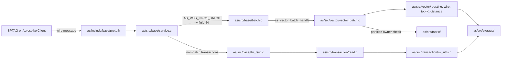

# Module Map

This is a narrow map for agents working on the SPTAG + Aerospike phases. It is not a complete Aerospike architecture document.

## Request Flow

Standard single-record reads still use `thr_tsvc` → `read.c` → `rw_utils.c`. **`VECTOR_DISTANCE` does not** — see Phase 3 hook below and [ADR 0004](../adr/0004-vector-distance-protocol.md).

## Key Modules

| Path | Role |
|------|------|
| `as/include/base/proto.h` | Wire protocol structs, result codes, `AS_MSG_OP_*`, and EC528 field types 44/45 (`VECTOR_DISTANCE`). |
| `as/src/base/service.c` | Socket ingress; diverts `AS_MSG_INFO1_BATCH` to batch queue. |
| `as/src/base/batch.c` | Batch ingress; detects field 44 and dispatches `as_vector_batch_handle()`. |
| `as/src/vector/vector_batch.c` | `VECTOR_DISTANCE` handler: decode, owner-local reads, top-K, encode response. |
| `as/include/vector/` | Vector subsystem headers (wire, posting, distance, digest, types). |
| `as/src/vector/` | Posting parser, SPTAG distance, wire codec, top-K, digest, namespace helpers. |
| `as/src/base/transaction.c` | Message field/op parsing and transaction preparation (non-vector paths). |
| `as/src/base/thr_tsvc.c` | Transaction service dispatch to read, write, UDF, delete, query, or batch subtransactions. |
| `as/src/transaction/read.c` | Local read execution, storage record load, bin-read op loop (not used for `VECTOR_DISTANCE`). |
| `as/src/transaction/rw_utils.c` | `process_bin_read_op()` for CDT/HLL/bits/exp reads (not used for `VECTOR_DISTANCE`). |
| `as/src/transaction/write.c` | Write pipeline and mixed op handling. |
| `as/src/storage/` | Record storage engines and flat record serialization. |
| `as/include/base/datamodel.h` | Particle types, bins, namespace struct, and namespace vector config fields. |
| `as/src/base/particle.c` | Particle vtable table; vector currently maps to blob vtable. |
| `as/src/base/particle_blob.c` | Blob and vector byte storage behavior. |
| `as/src/base/cfg.c` | Namespace config parser; `vector-dimension`, `vector-value-type`, `vector-metric`, limits. |
| `as/src/fabric/` | Cluster membership, partition ownership, migration, and ownership routing context. |
| `as/src/geospatial/` | Existing C++ server feature precedent (standalone C++ module pattern). |

## Phase 3 Hook

Implemented under `as/src/vector/` with entry from `as/src/base/batch.c`. Keep work key-scoped:

- **Wire:** `AS_MSG_INFO1_BATCH` + namespace field + `AS_MSG_FIELD_TYPE_VECTOR_DISTANCE` (44). Not `AS_MSG_FIELD_TYPE_BATCH` (41). Not `AS_MSG_OP_*` on the read path.
- **Input:** query vector plus listed `head_id_key` values (see `docs/contracts/sptag-aerospike.md`).
- **Record load:** digest from set + integer key → `as_record_get` on local master only; `wrong-owner` per key, no server forwarding.
- **Decode:** SPTAG posting layout from contract doc.
- **Output:** Owner-Local Top K in field 45 (`AS_MSG_FIELD_TYPE_VECTOR_DISTANCE_RESPONSE`).

Do not add graph traversal or partition-wide scans.

## Related Background Paths

| Path | Why It Matters |
|------|----------------|
| `as/src/query/query.c` | Background query path; useful contrast, not target hot path for `VECTOR_DISTANCE`. |
| `as/src/sindex/` | Secondary index subsystem; not SPTAG head graph ownership. |
| `as/include/fabric/hb.h` | `AS_CLUSTER_SZ` default. |
| `as/include/fabric/partition_balance.h` | `AS_CLUSTER_SZ` power-of-two constraint. |
| `docs/adr/0004-vector-distance-protocol.md` | Accepted wire entry point and partition behavior. |
