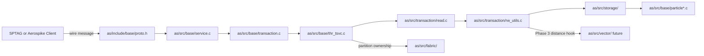

# Module Map

This is a narrow map for agents working on the SPTAG + Aerospike phases. It is not a complete Aerospike architecture document.

## Request Flow

## Key Modules

| Path | Role |
|------|------|
| `as/include/base/proto.h` | Wire protocol structs, result codes, and `AS_MSG_OP_*` operation IDs. |
| `as/src/base/service.c` | Socket ingress, protocol type dispatch, batch diversion, transaction startup. |
| `as/src/base/transaction.c` | Message field/op parsing and transaction preparation. |
| `as/src/base/thr_tsvc.c` | Transaction service dispatch to read, write, UDF, delete, query, or batch subtransaction paths. |
| `as/src/transaction/read.c` | Local read execution, storage record load, bin-read op loop. |
| `as/src/transaction/rw_utils.c` | `process_bin_read_op()` switch for read-side op semantics. |
| `as/src/transaction/write.c` | Write pipeline and mixed op handling. |
| `as/src/base/batch.c` | Batch request parsing and per-digest child transactions. |
| `as/src/storage/` | Record storage engines and flat record serialization. |
| `as/include/base/datamodel.h` | Particle types, bins, namespace struct, and namespace config fields. |
| `as/src/base/particle.c` | Particle vtable table; vector currently maps to blob vtable. |
| `as/src/base/particle_blob.c` | Blob and vector byte storage behavior. |
| `as/src/base/cfg.c` | Namespace config parser; Phase 3 vector config belongs here. |
| `as/src/fabric/` | Cluster membership, partition ownership, migration, and ownership routing context. |
| `as/src/geospatial/` | Existing C++ server feature precedent. |

## Phase 3 Hook

Phase 3 should add `as/src/vector/` for distance math, posting parsing, and request helpers. Keep the hook key-scoped:

- Input: query vector plus listed Head ID records.
- Record load: normal Aerospike key lookup path.
- Decode: SPTAG posting layout from `docs/contracts/sptag-aerospike.md`.
- Output: partial scored candidates for SPTAG merge.

Do not add graph traversal or partition-wide scans.

## Related Background Paths

| Path | Why It Matters |
|------|----------------|
| `as/src/query/query.c` | Background query path; useful contrast, not target hot path for `VECTOR_DISTANCE`. |
| `as/src/sindex/` | Secondary index subsystem; not SPTAG head graph ownership. |
| `as/include/fabric/hb.h` | `AS_CLUSTER_SZ` default. |
| `as/include/fabric/partition_balance.h` | `AS_CLUSTER_SZ` power-of-two constraint. |
